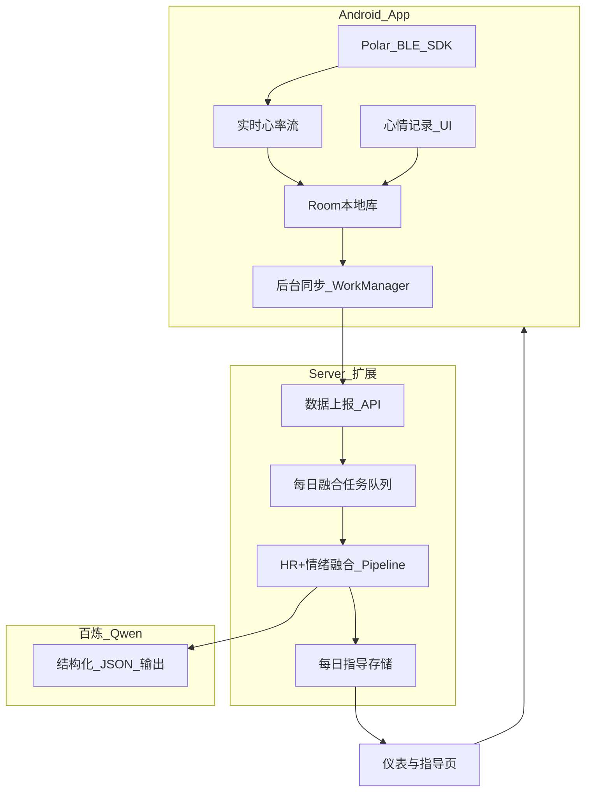

# Polar Loop + 心情记录 + 每日 AI 指导 — 产品规划

## 产品愿景

打造一款 **「身心状态一体化」** 的 Android 应用：手环提供客观生理信号（心率），App 内记录主观心理状态（价值感×耗能坐标 + 日记），云端 AI 将两者按时间对齐融合，结合历史洞察每日优化，输出 **新的指数、模式识别与行动指导**。

---

## 现状与差距分析

| 模块 | 现状 | 差距 |
|------|------|------|
| Polar Loop 心率 | [polar-ble-sdk-8.0.0](polar-ble-sdk-8.0.0) 支持在线 `startHrStreaming()` | 需新建 Android 工程；Loop 强制 FTU + 严格单设备配对（见 [Polar360.md](polar-ble-sdk-8.0.0/polar-ble-sdk-8.0.0/documentation/products/Polar360.md)） |
| 心情记录 | [emotion-2.1.0](emotion-2.1.0/emotion-2.1.0) 成熟：坐标+日记、提醒、仪表、AI 契约 v5 | 平台为 Windows Electron，需 **UI/数据模型移植到 Android**，去掉 IPC/本地文件 AI |
| AI 分析 | emotion 用 Claude Code 本地文件；server 用百炼 Qwen 处理录音 | 需 **新建融合 Pipeline**，非 ASR；每日自动触发 |
| 后端 | [server/backend](server/backend) FastAPI + Redis Worker + SQLite | 仅有 `audio_files` 表，需扩展 vitals/emotion/guidance 模型与 API |

**核心架构决策（已确认）：**
- 产品形态：**统一 Android App**
- AI 运行：**云端百炼自动分析**，App 展示结果

---

## 目标用户价值

1. **实时看见身体信号**：连接 Loop 后显示当前心率与当日趋势
2. **快速记录心理状态**：1～2 分钟完成坐标点选 + 短日记（移植 emotion 交互）
3. **获得每日指导**：每晚/次日凌晨自动生成「今日身心画像 + 明日建议」
4. **历史越用越准**：AI 输入包含近 7 日融合结果，实现 `continuity_summary` 式跨日优化（延续 [aiInsightManifest.ts](emotion-2.1.0/emotion-2.1.0/src/shared/aiInsightManifest.ts) v5 设计）

---

## 信息架构（Android App 页签）

| 页签 | 功能 | 来源参考 |
|------|------|----------|
| **仪表** | mood_index、心率摘要、成长阶段、今日主指导 | emotion `DashboardPage` |
| **心率** | 实时 BPM、当日曲线、连接状态 | Polar SDK + 新建 |
| **记录** | 价值感×耗能网格 + 日记输入 | emotion `MoodRecordForm` / `RecordViewportForm` |
| **历史** | 日记列表 + 关联时段心率快照 | emotion `EntryHistoryPage` |
| **指导** | 每日 AI 洞察全文（风险、模式、建议） | emotion `AiInsightPage` |
| **设备** | Loop 连接/FTU/配对引导 | Polar 文档 + 新建 |

---

## 数据模型设计

### 客户端（Room）

**`hr_samples`**：高频心率（本地全量永久保存 + SyncMeta；上传时按分钟聚合）
- `timestamp`, `bpm`, `rr_ms`（可选）, `@Embedded sync: SyncMeta`

**`mood_entries`**：移植 emotion `EntryRow`
- `id`, `fact`, `coord_x`, `coord_y`, `occurred_at`, `synced`
- 象限由 coord 推导（与 emotion 一致）

**`daily_guidance_cache`**：云端下发的当日指导 JSON

### 服务端（SQLite 扩展，新建表）

**`devices`**：`device_id`, `polar_id`, `ftu_done`, `created_at`

**`hr_samples`**：`device_id`, `timestamp`, `bpm`, `rr_ms`（按日分区索引）

**`mood_entries`**：`device_id`, `local_id`, `fact`, `coord_x`, `coord_y`, `occurred_at`

**`daily_fusion_jobs`**：复用现有 `pending/processing/completed/failed` 状态机（参考 [models.py](server/backend/app/models.py) `AudioFile`）

**`daily_guidance`**：融合输出
- 核心列：`date`, `device_id`, `risk_level`, `key_insight`, `guidance_primary`
- `payload_json`：扩展 emotion manifest v5 + 新增生理字段：
  - `hr_daily_avg`, `hr_resting_estimate`, `hr_during_high_stress_entries`
  - `mind_body_alignment`（主观耗能 vs 客观心率是否一致）
  - `mood_index`, `growth_phase_label`, `continuity_summary`（沿用 v5）
  - `guidance_target_time`, `recommendations[]`

### 融合对齐规则（非 AI，确定性预处理）

每条 `mood_entry` 匹配前后 **±5 分钟** 的 HR 样本，计算：
- `hr_at_entry`（均值）
- `hr_delta_from_baseline`（相对当日静息估计）

作为 LLM Prompt 的结构化输入，降低模型幻觉。

---

## AI 融合 Pipeline（云端）

在 [pipeline.py](server/backend/app/pipeline.py) 旁新建 `fusion_pipeline.py`，复用 `_run_llm_analysis` 的 **DashScope JSON 输出模式**：

**触发时机：**
- 每日 **22:30**（用户时区，默认 Asia/Shanghai）Cron 或 Redis 延迟队列
- 条件：当日至少有 1 条 mood_entry **或** HR 样本 > 30 条

**Prompt 输入：**
1. 当日 mood_entries（含象限、日记文本）
2. 当日 HR 统计（均值、峰值、静息估计、按小时分布）
3. entry-HR 对齐结果
4. 近 7 日 `daily_guidance` 摘要（用于 `continuity_summary` 跨日优化）
5. 昨日 `guidance_primary` 执行情况（若有用户反馈字段，二期再加）

**Prompt 输出契约：** emotion manifest **v6**（在 v5 基础上增加 `vitals_summary`, `mind_body_alignment`, `hr_context` 字段），存入 `payload_json`。

**失败策略：** 与录音 pipeline 一致，`failed` 可重试；App 展示昨日缓存 + 「分析中」状态。

---

## API 设计（server 扩展）

| 方法 | 路径 | 说明 |
|------|------|------|
| `POST` | `/api/vitals/hr/batch` | 批量上报 HR 样本 |
| `POST` | `/api/mood/entries` | 创建/更新心情记录 |
| `GET` | `/api/mood/entries?date=` | 按日查询 |
| `GET` | `/api/guidance/daily?date=&deviceId=` | 获取当日 AI 指导 |
| `GET` | `/api/guidance/history?days=7` | 近 N 日指导（仪表趋势） |
| `POST` | `/api/fusion/trigger` | 手动触发当日分析（调试/补跑） |

鉴权沿用 [auth.py](server/backend/app/auth.py) Bearer Token；`deviceId` 作为用户设备主键（单人自用阶段足够）。

---

## 分阶段交付计划

> **子 Plan 索引**（详细 todos 与验收标准见各子 Plan）：
> - Phase 2 → [phase2心情记录移植.plan.md](./phase2心情记录移植.plan.md)
> - Phase 3 → [phase3云端融合.plan.md](./phase3云端融合.plan.md)
> - Phase 4 → [phase4仪表与闭环.plan.md](./phase4仪表与闭环.plan.md)
> - P0 存储 → [统一存储核心模块_5f5a20f2.plan.md](./统一存储核心模块_5f5a20f2.plan.md)（已完成）

### Phase 1 — 基础连接（2～3 周）

**目标：** Loop 连上，屏幕显示实时心率。

- 新建 Android 工程（Kotlin + Jetpack Compose）
- 集成 [polar-ble-sdk-8.0.0](polar-ble-sdk-8.0.0/polar-ble-sdk-8.0.0) 本地 AAR 或 JitPack `8.0.0`
- 实现：权限申请 → 扫描/连接 → FTU 引导页 → `startHrStreaming()` → 实时 BPM UI
- Room 本地存储 HR 样本
- 参考：[使用说明.md](polar-ble-sdk-8.0.0/polar-ble-sdk-8.0.0/使用说明.md) 第六节、示例 [example-android](polar-ble-sdk-8.0.0/polar-ble-sdk-8.0.0/examples/example-android)

**验收：** 真机 Polar Loop 稳定显示心率 ≥ 30 分钟；断线可重连。

---

### Phase 2 — 心情记录移植（2 周）

**子 Plan：** [phase2心情记录移植.plan.md](./phase2心情记录移植.plan.md)

**目标：** App 内完成 emotion 核心记录体验。

从 emotion 移植（React → Compose 重写，逻辑对齐）：
- [ValueEnergyGrid](emotion-2.1.0/emotion-2.1.0/src/renderer/src/components/ValueEnergyGrid.tsx) 四象限点选
- [DiaryInput](emotion-2.1.0/emotion-2.1.0/src/renderer/src/components/DiaryInput.tsx) 日记输入
- [MoodRecordForm](emotion-2.1.0/emotion-2.1.0/src/renderer/src/components/MoodRecordForm.tsx) 提交流程
- 定时提醒（WorkManager 替代 Electron `daily-checkin-service`）
- 历史列表与编辑

**验收：** 全流程不依赖 Windows；记录可关联记录时刻的 HR 快照（本地查询）。

---

### Phase 3 — 云端同步 + 融合 Pipeline（2～3 周）

**子 Plan：** [phase3云端融合.plan.md](./phase3云端融合.plan.md)

**目标：** 数据上报 + 每日自动生成指导。

**Server：**
- 扩展 [main.py](server/backend/app/main.py)、[models.py](server/backend/app/models.py)、[worker.py](server/backend/app/worker.py)
- 新建 `fusion_pipeline.py` + 每日调度
- 定义 manifest v6 JSON Schema

**Android：**
- Retrofit API 客户端 + WorkManager 增量同步（HR 批量、entry 实时上报）
- 「指导」页展示 `guidance_primary`、`risk_level`、`mood_index`

**验收：** 当日有记录时，次日 8:00 前可在 App 看到新指导；内容与当日数据相关。

---

### Phase 4 — 仪表与历史优化（2 周）

**子 Plan：** [phase4仪表与闭环.plan.md](./phase4仪表与闭环.plan.md)

**目标：** 「每天生成新数据、新指导」的完整闭环。

- 仪表页：移植 emotion [DashboardPage](emotion-2.1.0/emotion-2.1.0/src/renderer/src/components/DashboardPage.tsx) 核心组件
  - `DashboardGuidanceCard`、`DashboardSparkline`、成长阶段
  - 新增 HR 折线叠加层
- 7 日趋势：mood_index + 静息心率趋势双轴
- 跨日 `continuity_summary` 展示
- 记录页顶部展示近 3 日 AI 摘要（emotion 已有此设计）

**验收：** 连续使用 7 天后，指导文案体现历史模式变化（非每日重复）。

---

## 关键技术风险与对策

| 风险 | 对策 |
|------|------|
| Loop 配对/FTU 门槛高 | Phase 1 专设「设备引导」页，分步 wizard；文档化恢复出厂流程 |
| 光学心率与主观情绪时间对齐误差 | ±5min 窗口 + 展示时标注「估计关联」 |
| 高频 HR 上报流量 | 本地全量永久保存；**上传**层按分钟均值聚合，原始 1Hz 不上传 |
| emotion AI 契约变更 | server 与 App 共用 manifest v6 常量（从 [aiInsightManifest.ts](emotion-2.1.0/emotion-2.1.0/src/shared/aiInsightManifest.ts) 移植为 Kotlin `AiInsightManifest.kt`） |
| 隐私 | 日记明文上传需 HTTPS + 用户知情同意；单人阶段 deviceId 隔离 |

---

## 建议技术栈汇总

| 层 | 选型 |
|----|------|
| Android UI | Jetpack Compose + Material 3 |
| Android 本地库 | Room + DataStore + WorkManager |
| Android 网络 | Retrofit + OkHttp |
| Polar 连接 | polar-ble-sdk 8.0.0 |
| 后端 | 现有 FastAPI + Redis Worker + SQLite（后期 HR 量大可迁 PostgreSQL/TimescaleDB） |
| AI | 百炼 Qwen（[config.py](server/backend/app/config.py) `LLM_MODEL`） |
| 部署 | 复用 [server/docker-compose.yml](server/docker-compose.yml) 四服务架构 |

---

## 不在本期范围（明确边界）

- iOS / Windows 同步版
- 实时流式 AI 对话
- 医疗级 HRV/压力诊断声明
- Polar Loop 睡眠/活动数据融合（二期可考虑 `get247HrSamples`）
- 多用户账号体系

---

## 成功指标（MVP 上线后 30 天）

- 日活连接 Loop 成功率 > 90%
- 日均心情记录 ≥ 1 条的用户占比 > 60%
- 每日指导生成成功率 > 95%
- 用户主观反馈：指导「与当日状态相关」（简单 App 内 1～5 分调研，二期）
