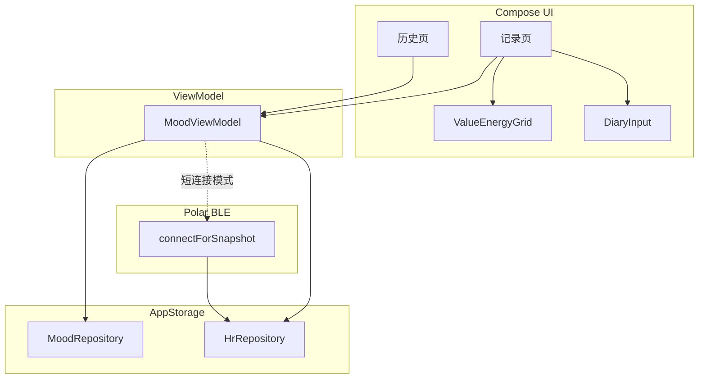

# Phase 2 — 心情记录移植

## 优先级与依赖

| 项 | 说明 |
|----|------|
| **优先级** | P2（见 [project-priority.mdc](../rules/project-priority.mdc)） |
| **前置** | P0 统一存储核心 ✅、P1 BLE/心率 ✅ |
| **阻塞** | Phase 3 云端同步需本 Phase 的 `mood_entries` 本地实体就绪 |
| **父 Plan** | [loop心情ai产品规划_9d502bd3.plan.md](./loop心情ai产品规划_9d502bd3.plan.md) |

---

## 设计目标

- 在 Android App 内完成 emotion **核心记录体验**，不依赖 Windows Electron
- 所有数据读写经 **`AppStorage`** 门面，遵循存储核心 4 步接入约定
- 每条心情记录可附带 **记录时刻 HR 估计值**（本地关联，无需网络）

---

## 目标架构

---

## 数据模型（Room）

新建 `MoodEntryEntity`（对齐 emotion `EntryRow`）：

| 字段 | 类型 | 说明 |
|------|------|------|
| `id` | Long PK | 自增 |
| `fact` | String | 日记正文 |
| `coord_x` | Int | 价值感 -4~+4 |
| `coord_y` | Int | 耗能度 -4~+4 |
| `occurred_at` | Long | 记录发生时间戳 |
| `hr_at_entry` | Int? | 关联 HR 快照（保存时计算） |
| `sync` | SyncMeta | `@Embedded`，沿用 P0 约定 |

象限由 coord 推导（与 emotion 一致）：攻坚区 / 心流区 / 机械区 / 内耗陷阱。

**接入步骤（存储 4 步）：**
1. `MoodEntryEntity` + `SyncMeta`
2. `MoodEntryDao` implements `SyncableDao`
3. `AppDatabase` v2→v3 + `MIGRATION_2_3`
4. `AppStorage.mood: MoodRepository`

---

## UI 移植对照

| emotion 源文件 | Android 目标 | todo |
|----------------|--------------|------|
| `ValueEnergyGrid.tsx` | `ui/mood/ValueEnergyGrid.kt` | value-energy-grid |
| `DiaryInput.tsx` | `ui/mood/DiaryInput.kt` | diary-input |
| `MoodRecordForm.tsx` | `ui/mood/MoodRecordScreen.kt` | mood-record-screen |
| `EntryHistoryPage.tsx` | `ui/mood/MoodHistoryScreen.kt` | history-screen |

参考路径：[emotion-2.1.0/emotion-2.1.0/src/renderer/src/components/](emotion-2.1.0/emotion-2.1.0/src/renderer/src/components/)

---

## HR 快照关联规则

保存 `mood_entry` 时：

1. **常连接模式**：从 `storage.hr` 查询 `occurred_at ± 5 分钟` 内样本，取 BPM 均值写入 `hr_at_entry`
2. **短连接模式**：若窗口内无样本，调用 [PolarBleManager.connectForSnapshot](mindbody-android/app/src/main/java/com/owner/mindbody/polar/PolarBleManager.kt) 采集约 5 秒后写入
3. UI 标注「估计关联」，不做医疗级断言

---

## 定时提醒

- 使用 **WorkManager** `PeriodicWorkRequest`（替代 emotion `daily-checkin-service`）
- 设置项：提醒间隔、静默时段（DataStore 持久化，可参考 emotion 设置页逻辑）
- **保存后仍按间隔提醒**（与 emotion v3 行为一致）

---

## 文件变更清单（预期）

**新建：**
- `data/local/MoodEntryEntity.kt`、`MoodEntryDao.kt`、`MoodRepository.kt`
- `ui/mood/` 下 Compose 组件与 ViewModel
- `worker/MoodReminderWorker.kt`

**改造：**
- `data/local/AppDatabase.kt`（v3 + migration）
- `data/storage/AppStorage.kt`（暴露 `mood`）
- 主导航 / `MainActivity`（新增页签）

---

## 验收标准

1. 全流程不依赖 Windows；可在真机完成「点选坐标 → 写日记 → 保存 → 历史查看/编辑」
2. 每条 mood 记录带有 `hr_at_entry`（有 HR 数据时）或明确为空（无手环时仍可记录）
3. 定时提醒到点可打开记录页；设置静默时段内不弹
4. 所有 mood 读写经 `app.storage.mood`，无绕过 AppStorage 的直接 DAO 调用
5. `getUnsynced()` 可返回未同步 mood 记录，为 Phase 3 上报就绪
