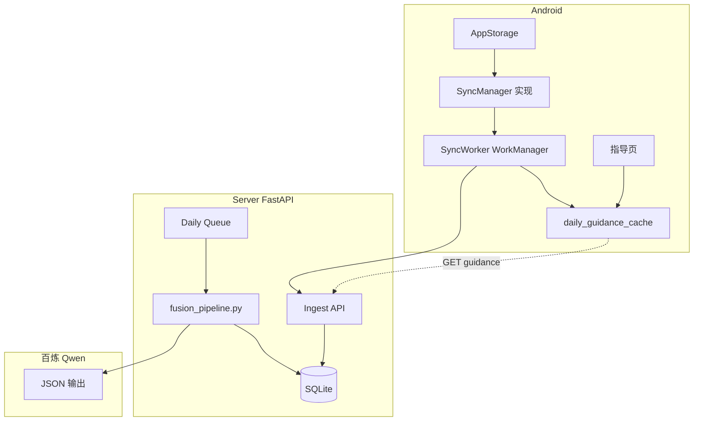

# Phase 3 — 云端同步 + 融合 Pipeline

## 优先级与依赖

| 项 | 说明 |
|----|------|
| **优先级** | P3（见 [project-priority.mdc](../rules/project-priority.mdc)） |
| **前置** | Phase 2 `mood_entries` 本地实体 ✅、P0 SyncManager 占位 ✅ |
| **阻塞** | Phase 4 仪表页需本 Phase 的 `daily_guidance` 数据 |
| **父 Plan** | [loop心情ai产品规划_9d502bd3.plan.md](./loop心情ai产品规划_9d502bd3.plan.md) |

---

## 设计目标

- Android 增量同步 HR + mood 至 server，弱网可用、本地优先
- 云端 **每日自动** 融合 HR 与情绪，百炼 Qwen 输出结构化指导（manifest v6）
- App「指导」页展示当日 AI 洞察，失败时展示昨日缓存 +「分析中」

---

## 目标架构

---

## Server 数据模型

扩展 [server/backend/app/models.py](server/backend/app/models.py)：

| 表 | 核心字段 |
|----|----------|
| `devices` | device_id, polar_id, ftu_done, created_at |
| `hr_samples` | device_id, timestamp, bpm, rr_ms |
| `mood_entries` | device_id, local_id, fact, coord_x, coord_y, occurred_at, hr_at_entry |
| `daily_fusion_jobs` | 状态机 pending/processing/completed/failed（参考 AudioFile） |
| `daily_guidance` | date, device_id, risk_level, key_insight, guidance_primary, payload_json |

---

## API 设计

| 方法 | 路径 | 说明 |
|------|------|------|
| `POST` | `/api/vitals/hr/batch` | 批量上报 HR（上传层按分钟聚合；本地仍全量保留） |
| `POST` | `/api/mood/entries` | 创建/更新心情 |
| `GET` | `/api/mood/entries?date=` | 按日查询 |
| `GET` | `/api/guidance/daily?date=&deviceId=` | 获取当日指导 |
| `GET` | `/api/guidance/history?days=7` | 近 N 日指导 |
| `POST` | `/api/fusion/trigger` | 手动触发（调试） |

鉴权：沿用 [auth.py](server/backend/app/auth.py) Bearer Token；`deviceId` 作设备主键。

---

## 融合 Pipeline

新建 [fusion_pipeline.py](server/backend/app/fusion_pipeline.py)，复用 `_run_llm_analysis` DashScope JSON 模式。

**触发：** 每日 22:30（Asia/Shanghai）；条件：当日 ≥1 mood_entry **或** HR 样本 >30 条。

**Prompt 输入：**
1. 当日 mood_entries（象限、日记）
2. 当日 HR 统计（均值、峰值、静息估计、小时分布）
3. entry-HR 对齐结果（±5min 窗口，确定性预处理）
4. 近 7 日 `daily_guidance` 摘要（`continuity_summary`）
5. 昨日 `guidance_primary`（二期加用户反馈）

**输出：** manifest **v6** → `payload_json`（在 v5 基础上增加 `vitals_summary`、`mind_body_alignment`、`hr_context`）

**失败策略：** 与录音 pipeline 一致，failed 可重试；App 展示缓存。

---

## Android 同步实现

对接 P0 预留接口：

- 实现 [SyncManager.kt](mindbody-android/app/src/main/java/com/owner/mindbody/data/sync/SyncManager.kt)（替换空实现）
- `SyncableDao.getUnsynced()` → Retrofit 上报 → `markSynced` / `markFailed`
- WorkManager：HR 批量（如每 15min）、mood 保存后立即 enqueue
- 新建 `daily_guidance_cache` 实体（存储 4 步接入 AppStorage）

参考 manifest：[aiInsightManifest.ts](emotion-2.1.0/emotion-2.1.0/src/shared/aiInsightManifest.ts) → Kotlin `AiInsightManifest.kt`

---

## 文件变更清单（预期）

**Server 新建/改造：**
- `app/fusion_pipeline.py`
- `app/models.py`、`main.py`、`worker.py` 扩展

**Android 新建/改造：**
- `data/remote/` Retrofit API + DTO
- `data/sync/SyncManager.kt` 完整实现
- `worker/SyncWorker.kt`
- `data/local/DailyGuidanceEntity.kt` + Repository
- `ui/guidance/` 指导页

---

## 验收标准

1. 当日有 mood 或足够 HR 时，**次日 8:00 前** App 可看到新指导
2. 指导内容与当日数据相关（含 HR 上下文，非空泛套话）
3. 弱网：本地记录不丢，恢复网络后自动补传
4. 融合失败可重试；App 不白屏（展示缓存或「分析中」）
5. HR 上报为聚合数据；**本地 hr_samples 仍全量永久保存**（与 P0 一致）
