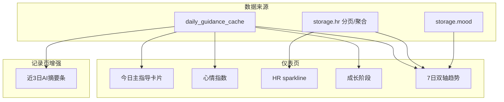

# Phase 4 — 仪表与历史优化（完整闭环）

## 优先级与依赖

| 项 | 说明 |
|----|------|
| **优先级** | P4（见 [project-priority.mdc](../rules/project-priority.mdc)） |
| **前置** | Phase 3 每日指导可稳定生成并缓存至本地 |
| **父 Plan** | [loop心情ai产品规划_9d502bd3.plan.md](./loop心情ai产品规划_9d502bd3.plan.md) |

---

## 设计目标

- 用户打开 App **第一眼**看到今日身心概览：心情指数、HR 摘要、成长阶段、主指导
- **7 日趋势**帮助看见模式；`continuity_summary` 体现 AI 跨日记忆
- 记录页嵌入近 3 日摘要，降低「写了不知道有什么用」的摩擦
- MVP 闭环：**Loop 采集 → 本地记录 → 云端融合 → 仪表回顾 → 次日更好指导**

---

## 目标架构

---

## UI 移植对照

| emotion 源 | Android 目标 | todo |
|------------|--------------|------|
| `DashboardPage.tsx` | `ui/dashboard/DashboardScreen.kt` | dashboard-screen |
| `DashboardGuidanceCard` | `ui/dashboard/DashboardGuidanceCard.kt` | dashboard-screen |
| `DashboardSparkline` | `ui/dashboard/HrSparklineOverlay.kt` | dashboard-hr-sparkline |
| 7 日趋势（新建） | `ui/dashboard/SevenDayTrendChart.kt` | seven-day-trends |
| 记录页 AI 摘要条 | `ui/mood/MoodRecordScreen` 顶部组件 | record-page-summary |

参考：[DashboardPage.tsx](emotion-2.1.0/emotion-2.1.0/src/renderer/src/components/DashboardPage.tsx)

---

## 数据与展示逻辑

### 仪表页

- **mood_index**、**risk_level**、**guidance_primary**：来自当日 `daily_guidance_cache`
- **HR 摘要**：`storage.hr` 当日聚合（avg/min/max，与心率页一致）
- **成长阶段** `growth_phase_label`：来自 manifest payload
- **7 日趋势**：GET `/api/guidance/history?days=7` 或本地 cache 聚合；Y 轴 mood_index + 静息 HR 估计

### continuity_summary

- 展示最近一条 guidance 的 `continuity_summary` 字段
- 文案说明「基于近 7 日模式」，与 Phase 3 Pipeline 输入/output 对齐

### 记录页摘要

- 拉取近 3 日 `key_insight` 或 `guidance_primary` 首句，横向卡片展示
- 无指导数据时隐藏或展示引导文案

---

## 导航调整

当前 Phase 1 以心率/设备为主；Phase 4 完成后：

| 页签 | 说明 |
|------|------|
| **仪表** | 默认首页（新增） |
| 心率 | Phase 1 已有 |
| 记录 | Phase 2 |
| 历史 | Phase 2 |
| 指导 | Phase 3 全文页 |
| 设备 | Phase 1 已有 |

---

## 文件变更清单（预期）

**新建：**
- `ui/dashboard/` 全套 Compose 组件 + `DashboardViewModel`

**改造：**
- 主导航默认页改为仪表
- `MoodRecordScreen` 增加摘要条
- 可选：合并「指导」页与仪表卡片跳转 deep link

---

## 验收标准

1. 打开 App 默认进入仪表，一屏可见今日指导 + mood_index + HR  sparkline
2. 7 日趋势图可切换或同屏展示 mood_index 与静息 HR
3. `continuity_summary` 在有 7 日数据时可见且非空
4. 记录页顶部展示近 3 日 AI 摘要（有数据时）
5. **连续使用 7 天后**，指导文案能体现历史模式变化（人工抽检 + 对比每日 `guidance_primary` 非重复）

---

## MVP 成功指标（回顾）

| 指标 | 目标 |
|------|------|
| 日活连接 Loop 成功率 | > 90% |
| 日均心情记录 ≥ 1 条用户占比 | > 60% |
| 每日指导生成成功率 | > 95% |

详见 [PRODUCT.md](../../mindbody-android/PRODUCT.md)
