# 实时生理状态检测系统 — 详细实施计划

## 现状评估与可复用资产

### 直接可用（无需改动）
- **PPI 采集链路**：`PolarBleManager.processPpiData()` → `PpiRepository.saveSample()` → `ppi_samples` 表；数据质量已验证（昨日 57,710 行，过滤后 34,821 行）
- **Redis**：`docker-compose.yml` 中已运行 `redis:7-alpine`，可直接用于 EWMA 基线存储
- **APScheduler**：`main.py` 第 246–273 行已有每日任务调度框架
- **分析算法**：`sandbox/analyze_hrv_advanced.py` 完整实现了 HeartPy + Poincaré + SampEn + DFA，可直接移植
- **个人基线参考值**（设备 `83f94020`）：RMSSD=56.3ms、SDNN=101.7ms、LF/HF=0.68、SampEn=1.21、DFA_α1=0.826

### 需要新增的核心基础设施
- Android：60 秒 PPI 窗口缓冲 + 专用推流通道（不影响现有 2h 批量同步）
- Server：推流端点 + 5 张新表 + HeartPy 依赖 + 分析/分类/LLM 服务
- FCM：Firebase 项目配置（Phase 5 的前置依赖）

---

## Phase 1：数据推流管道（Android + Server）

**目标**：每 60 秒把最近一个 PPI 窗口（约 60 次心跳）推送到服务器，同时在 Android 端计算轻量 on-device RMSSD 作为质量指标。

### 1-A  Android — On-Device HRV 轻量计算

**新建** [`data/HrvOnDevice.kt`](mindbody-android/app/src/main/java/com/owner/mindbody/data/HrvOnDevice.kt)

纯 Kotlin 工具对象，无第三方库：

```kotlin
object HrvOnDevice {
    fun rmssd(rrListMs: List<Int>): Double   // sqrt(mean(diff²))
    fun sdnn(rrListMs: List<Int>): Double    // std(rr)
    fun pnn50(rrListMs: List<Int>): Double   // count(|diff|>50)/n
}
```

**改动量**：~40 行，零依赖，可单元测试。

---

### 1-B  Android — PPI 环形缓冲区

**新建** [`data/stream/PpiLiveBuffer.kt`](mindbody-android/app/src/main/java/com/owner/mindbody/data/stream/PpiLiveBuffer.kt)

```kotlin
class PpiLiveBuffer(val maxSize: Int = 600) {
    // 线程安全的循环队列，存储 (timestamp, ppi_ms, hr_bpm, blocker_bit, skin_contact_status)
    fun push(ts: Long, ppiMs: Int, hrBpm: Int, blocker: Boolean, skinOk: Boolean)
    fun drainWindow(sinceMs: Long): List<PpiSample>  // 取 sinceMs 之后的有效样本（非blocker且skinOk）
    fun lastTs(): Long
}
```

**与 PolarBleManager 的挂接**：在 `processPpiData()` 中额外调用 `ppiLiveBuffer.push(...)` （当前代码只调用 `storage.ppi.saveSample`，新增一行，不改变存储流程）。`PpiLiveBuffer` 实例挂在 `PolarBleManager` 上，通过 `MindBodyApplication.polarBleManager.ppiLiveBuffer` 访问。

---

### 1-C  Android — 推流 HTTP 客户端

**修改** [`data/sync/SyncApiClient.kt`](mindbody-android/app/src/main/java/com/owner/mindbody/data/sync/SyncApiClient.kt)

新增方法：

```kotlin
suspend fun postPpiWindow(payload: PpiWindowPayload): PpiWindowResult
// POST {baseUrl}/api/vitals/stream/ppi-window
// Body: { device_id, window_start_ts, window_end_ts, rr_list_ms[], n_raw, n_clean,
//         on_device_rmssd, on_device_sdnn, acc_magnitude_mean }
```

`PpiWindowPayload` / `PpiWindowResult` 新增两个数据类（约 20 行）。

---

### 1-D  Android — 推流 Worker

**新建** [`worker/PpiStreamWorker.kt`](mindbody-android/app/src/main/java/com/owner/mindbody/worker/PpiStreamWorker.kt)

```kotlin
class PpiStreamWorker : CoroutineWorker {
    override suspend fun doWork(): Result {
        // 1. 从 app.polarBleManager.ppiLiveBuffer 取最近 60 秒窗口
        // 2. 质量门控：n_clean >= 20
        // 3. HrvOnDevice.rmssd/sdnn 计算 on-device 指标
        // 4. app.storage.syncPreferences 取 baseUrl/apiKey
        // 5. SyncApiClient.postPpiWindow(payload)
        // 6. 失败则 Result.retry()（最大重试 3 次）
    }
    companion object {
        fun scheduleRepeating(context: Context)  // 每 60 秒 PeriodicWorkRequest，flex=10s
        fun cancel(context: Context)
    }
}
```

**在 `MindBodyApplication.onCreate()` 注册**（与 SyncWorker 同级）：

```kotlin
PpiStreamWorker.scheduleRepeating(this)
```

**注意**：此 Worker 仅在 BLE 已连接且 `syncEnabled=true` 时才实际推送；检查 `app.polarBleManager.connectionState.value == ConnectionState.CONNECTED`。

---

### 1-E  Server — 推流端点 + 新建 5 张表

**修改** [`server/backend/app/vitals_models.py`](server/backend/app/vitals_models.py)

新增 5 张表（混入 `Base`）：

| 表名 | 核心字段 |
|------|---------|
| `ppi_analysis_windows` | `device_id`, `window_start_ts`, `window_end_ts`, `rr_list_ms`(JSON), `n_raw`, `n_clean`, `on_device_rmssd`, `on_device_sdnn`, `acc_magnitude_mean` |
| `hrv_analysis_results` | `window_id`(FK), `device_id`, `ts`, `bpm`, `rmssd`, `sdnn`, `pnn50`, `lf_hf`, `sd1`, `sd2`, `sampen`, `dfa_alpha1`, `breathing_rate`, `hr_surge_flag` |
| `physio_state_classifications` | `window_id`(FK), `device_id`, `ts`, `anxiety_score`, `state_label`, `z_scores`(JSON) |
| `llm_feedback_history` | `device_id`, `ts`, `state_label`, `anxiety_score`, `message`, `tone`, `triggered_notification` |
| `physio_state_labels` | `window_id`(FK), `device_id`, `label`, `labeled_by`, `labeled_at` |

`ppi_analysis_windows` 设为 TimescaleDB hypertable（在 `database.py` 的 `_create_hypertables` 中补充）。

**新建** [`server/backend/app/stream_routes.py`](server/backend/app/stream_routes.py)

```python
router = APIRouter(prefix="/api/vitals/stream", dependencies=[Depends(verify_api_key)])

@router.post("/ppi-window")
async def ingest_ppi_window(payload: PpiWindowRequest, background_tasks: BackgroundTasks, db: Session = Depends(get_db)):
    # 1. 写入 ppi_analysis_windows
    # 2. background_tasks.add_task(analyze_hrv_async, window_id, db) → Phase 2 触发点
    # 3. 返回 {window_id, accepted: true}
```

**修改** [`server/backend/app/main.py`](server/backend/app/main.py)

第 40–41 行处补挂 `stream_router`：

```python
from app.stream_routes import router as stream_router
app.include_router(stream_router)
```

**修改** [`server/backend/requirements.txt`](server/backend/requirements.txt)

新增：
```
heartpy>=1.2.7
scipy>=1.11.0
numpy>=1.26.0
```

---

## Phase 2：HRV 分析引擎（Server）

**目标**：接收推流窗口后异步计算全套 HRV 指标，维护个人 EWMA 基线，检测呼吸频率和心率突升。

### 2-A  HRV 分析服务

**新建** [`server/backend/app/services/hrv_analysis_service.py`](server/backend/app/services/hrv_analysis_service.py)

从 `sandbox/analyze_hrv_advanced.py` 移植并适配为可调用服务：

```python
class HrvAnalysisService:
    def analyze_window(self, window: PpiAnalysisWindow, db: Session) -> HrvAnalysisResult:
        # 1. 从 window.rr_list_ms 重建 rr_clean（复用 build_rr_list 逻辑）
        # 2. 质量门控：n_clean >= 30 且 coverage >= 60%
        # 3. hp.process_rr(rr_clean, calc_freq=True, welch_wsize=max(30, n/200))
        # 4. poincare_measures, pnn_measures, sample_entropy, dfa_measures（直接复制 sandbox 函数）
        # 5. 新增：breathing_rate_bpm = hf_peak_hz * 60（从 HeartPy welch 频谱提取）
        # 6. 新增：hr_surge_flag = baseline.current_bpm - baseline.resting_bpm > 10
        # 7. 皮肤温度 5 分钟滑动均值（查 skin_temp_samples 表）
        # 8. 写入 hrv_analysis_results，调用 baseline_manager.update()
        # 9. 调用 state_classifier（Phase 3）
```

**关键实现细节**：
- `build_rr_list()` 中质量过滤条件对齐现有 `ppi_samples` 字段：`ppi_ms > 200 AND ppi_ms < 2000 AND blocker_bit = False AND skin_contact_status = True`
- 频域 `breathing_rate`：HeartPy `wd["frq"]` 和 `wd["psd"]` 中 HF 频段（0.15–0.4 Hz）的峰值频率，乘以 60
- `hr_surge_flag`：查 Redis 基线中 `resting_bpm_ewma`，当前窗口 `bpm - resting_bpm_ewma > 10`，并且 `acc_magnitude_mean < acc_baseline + 2σ`（排除运动）

---

### 2-B  基线管理器

**新建** [`server/backend/app/services/baseline_manager.py`](server/backend/app/services/baseline_manager.py)

```python
class BaselineManager:
    ALPHA = 0.05  # EWMA decay，约 4.5 小时半衰期
    TTL_S = 48 * 3600
    MIN_WINDOWS = 50  # 基线成熟所需最少窗口数

    def __init__(self, redis_client):
        self.redis = redis_client

    def get_baseline(self, device_id: str) -> dict | None:
        # Redis key: "baseline:{device_id}" → JSON
        # 字段: rmssd, sdnn, pnn50, lf_hf, sd1_sd2, sampen, dfa_alpha1,
        #        breathing_rate, bpm, skin_temp_c, window_count

    def update(self, device_id: str, hrv_result: HrvAnalysisResult):
        # EWMA 更新：new = alpha * current + (1-alpha) * old
        # window_count += 1
        # 每天 03:00 UTC 快照写入 device_baseline_snapshots（复用 APScheduler）

    def is_mature(self, device_id: str) -> bool:
        # window_count >= MIN_WINDOWS
```

**Redis 连接复用**：`main.py` 第 44–47 行已创建 `redis_client`，通过 `app.state.redis` 传递给服务实例，不新建连接。

---

## Phase 3：状态分类器（Server）

**目标**：将 HRV 指标转为 0-100 焦虑分，输出状态标签，带冷却机制。

### 3-A  分类器服务

**新建** [`server/backend/app/services/state_classifier.py`](server/backend/app/services/state_classifier.py)

```python
WEIGHTS = {
    "rmssd":           0.12,  # ↓焦虑
    "pnn50":           0.08,
    "sdnn":            0.05,
    "sd1_sd2":         0.08,
    "lf_hf":           0.12,  # ↑焦虑
    "sampen":          0.08,  # ↓焦虑
    "dfa_alpha1_dev":  0.08,  # |α1 - 1.0| ↑焦虑
    "hr_surge":        0.15,  # bool → 1 or 0
    "breathing_rate":  0.08,  # ↑焦虑
}

class StateClassifier:
    def classify(self, hrv: HrvAnalysisResult, baseline: dict, acc_ok: bool, skin_temp_delta: float) -> Classification:
        # 1. 各指标 z-score：(current - baseline_mean) / baseline_std
        # 2. 加权求和，映射到 0-100
        # 3. 皮肤温度调节：↓>0.3°C → ×1.2；↑>0.5°C → ×0.7
        # 4. ACC 运动抑制：acc_ok=False → ×0.5
        # 5. 冷却检查（Redis key "cooldown:{device_id}"）
        # 6. 写入 physio_state_classifications
        # 返回：{anxiety_score, state_label, z_scores, should_notify, cooldown_until}
```

**状态阈值**（直接编码）：

| 分数 | 标签 | 冷却 | 触发通知 |
|------|------|------|---------|
| 0–20 | calm | — | No |
| 20–40 | normal | — | No |
| 40–60 | elevated | 120 min | Yes（轻） |
| 60–80 | anxious | 60 min | Yes（关切） |
| 80–100 | high_anxiety | 30 min | Yes（紧急） |

**基线成熟度门控**：`baseline_manager.is_mature(device_id) == False` 时，仅记录不触发通知。

---

## Phase 4：大模型集成（Server）

**目标**：状态达到阈值时调用 Claude Haiku 生成个性化中文反馈，不可用时降级到模板。

### 4-A  LLM 反馈服务

**修改** [`server/backend/requirements.txt`](server/backend/requirements.txt)

```
anthropic>=0.25.0
```

**新建** [`server/backend/app/services/llm_feedback_service.py`](server/backend/app/services/llm_feedback_service.py)

```python
FALLBACK_TEMPLATES = {
    "elevated":    "你的身体似乎在提醒你放慢一下节奏。现在感觉怎么样？",
    "anxious":     "心率和呼吸有些变化——是最近发生了什么吗？写下来也许会轻松些。",
    "high_anxiety":"此刻状态有些紧绷。深呼吸，或者把此刻的感受记录下来。",
}

class LlmFeedbackService:
    async def generate(self, classification: Classification, baseline: dict, last_mood: MoodEntry | None) -> FeedbackResult:
        context = self._build_context(classification, baseline, last_mood)
        try:
            # anthropic.AsyncAnthropic().messages.create(model="claude-haiku-4-5", max_tokens=200)
            # 超时 5 秒
            message = await asyncio.wait_for(self._call_llm(context), timeout=5.0)
        except (TimeoutError, Exception):
            message = FALLBACK_TEMPLATES.get(classification.state_label, FALLBACK_TEMPLATES["elevated"])
        # 写入 llm_feedback_history
        return FeedbackResult(message, tone, should_notify=True)
```

**上下文构建** `_build_context()`：输入包含 `anxiety_score`, `state_label`, `bpm vs baseline`, `rmssd vs baseline`, `lf_hf vs baseline`, `breathing_rate vs baseline`, `sampen vs baseline`, `skin_temp_delta`, `acc_ok`, `last_mood`（时间 + 内容）、`last_notification`（时间 + 用户响应）。

**配置**：新增 `config.py` 环境变量 `ANTHROPIC_API_KEY`。

---

## Phase 5：通知推送（Android + Server）

**目标**：LLM 生成反馈后通过 FCM 推送到 Android，支持三按钮操作。

### 5-A  前置：Firebase 项目配置

- Android：`mindbody-android/app/google-services.json`（Firebase Console 下载）
- Android `build.gradle.kts`：加 `implementation("com.google.firebase:firebase-messaging:24.x.x")`
- Server：`pip install firebase-admin`，服务账号 JSON 挂载到容器

### 5-B  Android — 推送接收器

**新建** [`notification/PhysioNotificationManager.kt`](mindbody-android/app/src/main/java/com/owner/mindbody/notification/PhysioNotificationManager.kt)

- 通知渠道 `physio_feedback`（高优先级）
- 三按钮：`ACTION_LOG_MOOD`（打开记录页）/ `ACTION_SNOOZE`（15min 后重推）/ `ACTION_DISMISS_TODAY`（当天 UUID 写 DataStore）

**新建** [`notification/PhysioFcmService.kt`](mindbody-android/app/src/main/java/com/owner/mindbody/notification/PhysioFcmService.kt)

继承 `FirebaseMessagingService`：
- `onNewToken(token)` → `SyncApiClient.registerFcmToken(deviceId, token)` → `POST /api/vitals/stream/register-token`
- `onMessageReceived(message)` → `PhysioNotificationManager.show(message.data)`

**修改** [`AndroidManifest.xml`](mindbody-android/app/src/main/AndroidManifest.xml)：注册 `PhysioFcmService`。

### 5-C  Server — FCM 推送服务

**新建** [`server/backend/app/services/push_service.py`](server/backend/app/services/push_service.py)

```python
class PushService:
    async def send(self, device_id: str, message: str, state_label: str):
        token = self._get_token(device_id)  # 查 fcm_tokens 表
        if not token: return
        if self._is_sleep_time(): return      # 00:00–07:00 不推
        if self._daily_count(device_id) >= 3: return  # 最大 3 次/天
        # firebase_admin.messaging.send()
```

**新增表** `fcm_tokens`（`device_id`, `token`, `updated_at`），在 `vitals_models.py` 追加。

**新增端点**（`stream_routes.py`）：
```
POST /api/vitals/stream/register-token   { device_id, fcm_token }
POST /api/vitals/stream/snooze           { device_id, delay_min=15 }
```

---

## Phase 6：反馈闭环

**目标**：用户响应（记录心情、忽略、推迟）反向校准基线和 LLM 模板权重。

### 6-A  响应追踪

**新建** [`server/backend/app/services/feedback_loop_service.py`](server/backend/app/services/feedback_loop_service.py)

```python
class FeedbackLoopService:
    def on_mood_logged(self, device_id: str, mood: MoodEntry, window_id: int | None):
        # 1. 如果 mood 记录时间在最近一次通知 5 分钟内：标记为 "responded"
        # 2. 写入 physio_state_labels（window_id + label）
        # 3. 更新模板权重：该 state_label 对应的 tone 的 response_rate += 1 step

    def on_notification_dismissed(self, device_id: str, notification_id: str):
        # 对应 tone 的 ignore_rate += 1 step

    def get_best_tone(self, state_label: str) -> str:
        # 返回该状态下 response_rate 最高的 tone
```

**新增表** `template_weights`（`state_label`, `tone`, `response_count`, `total_count`）。

### 6-B  LLM 上下文丰富

**修改** `llm_feedback_service.py` 的 `_build_context()`，从 `physio_state_labels` 查过去 7 天的标注，加入 LLM prompt：

```
- 历史模式: 过去 7 天中有 3 次类似状态，其中 2 次你在记录日记后反馈"好多了"
```

### 6-C  Android — 用户响应回报

**修改** `PhysioNotificationManager.kt` 中的 `ACTION_DISMISS_TODAY`、`ACTION_SNOOZE` 处理：

```kotlin
// 回报服务器
SyncApiClient.reportNotificationResponse(notificationId, "dismissed" | "snoozed" | "logged")
// POST /api/vitals/stream/notification-response
```

---

## 文件变更汇总

### 新建文件（16 个）

**Android（6）**
- `data/HrvOnDevice.kt`
- `data/stream/PpiLiveBuffer.kt`
- `worker/PpiStreamWorker.kt`
- `notification/PhysioNotificationManager.kt`
- `notification/PhysioFcmService.kt`

**Server（11）**
- `backend/app/stream_routes.py`
- `backend/app/services/hrv_analysis_service.py`
- `backend/app/services/baseline_manager.py`
- `backend/app/services/state_classifier.py`
- `backend/app/services/llm_feedback_service.py`
- `backend/app/services/push_service.py`
- `backend/app/services/feedback_loop_service.py`

### 修改文件（7 个）

| 文件 | 改动 |
|------|------|
| `PolarBleManager.kt` | `processPpiData` 额外调用 `ppiLiveBuffer.push()`，暴露 `ppiLiveBuffer` 属性 |
| `SyncApiClient.kt` | 新增 `postPpiWindow`、`registerFcmToken`、`reportNotificationResponse` |
| `MindBodyApplication.kt` | 注册 `PpiStreamWorker.scheduleRepeating` |
| `AndroidManifest.xml` | 注册 `PhysioFcmService` |
| `vitals_models.py` | 新增 5 张分析表 + `fcm_tokens` + `template_weights` |
| `main.py` | 挂载 `stream_router`，注入 baseline_manager 到 `app.state` |
| `requirements.txt` | 新增 `heartpy`, `scipy`, `numpy`, `anthropic`, `firebase-admin` |

---

## 验收节点（按 Phase）

```mermaid
flowchart LR
    P1["Phase 1: 推流管道"] --> P1v["ppi_analysis_windows 有记录\n60s 一条，n_clean>=20"]
    P1v --> P2["Phase 2: HRV 分析"]
    P2 --> P2v["hrv_analysis_results vs sandbox\n差异 <5%"]
    P2v --> P3["Phase 3: 分类器"]
    P3 --> P3v["5 组模拟数据\n标签全部正确"]
    P3v --> P4["Phase 4: LLM"]
    P4 --> P4v["消息 <150 字\n无医学诊断词"]
    P4v --> P5["Phase 5: FCM"]
    P5 --> P5v["通知到达 <5s\n三按钮行为正确"]
    P5v --> P6["Phase 6: 闭环"]
    P6 --> P6v["20 次模拟后\n模板权重反映响应率"]
```



---

## 风险与注意事项

- **PpiLiveBuffer 与 PpiRepository 并行写入**：两者互相独立，Buffer 是纯内存、Repository 是 Room DB，不共享数据，不会产生冲突
- **推流 Worker 最小周期为 15 分钟**（WorkManager 限制）；推流实际改用 `HrStreamService` 内的协程 `delay(60_000)` 循环更精准
- **HeartPy 频域分析对短窗口敏感**：60s 窗口仅 ~60 个 RR，频谱分辨率有限；建议以 120s 或 300s 作为频域计算的最小窗口（可在 `hrv_analysis_service` 中对短窗口跳过频域，仅算时域指标）
- **LLM API Key 安全**：`ANTHROPIC_API_KEY` 通过 ECS 环境变量注入，不进 `docker-compose.yml` 明文
- **FCM 依赖 Google 服务**：确认目标用户设备有 Google Play Services；如无，Phase 5 需备用 WebSocket 或本地通知方案
