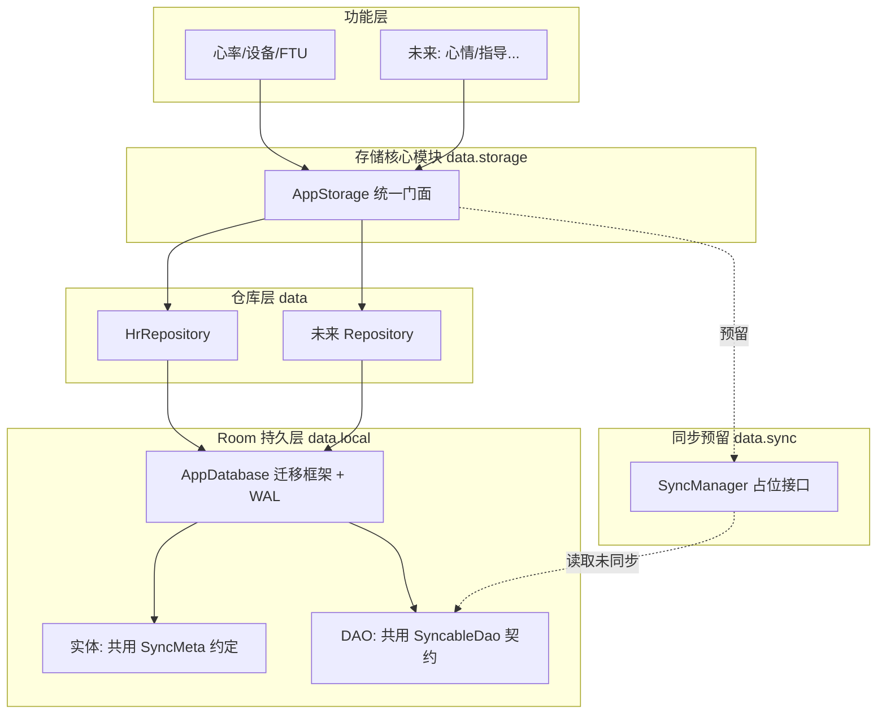

# 统一存储核心模块设计方案

## 设计目标（对应你的需求）

- **完整性**：去掉 24h 自动删除，原始心率全量永久保存，任何数据不丢
- **可无缝扩展**：建立 Room 迁移框架 + 统一实体约定，后期加新数据类型只需固定 4 步
- **最高优先级板块**：独立 `data/storage` 门面，所有功能只通过它读写
- **方便调用**：单一入口 `AppStorage`，挂在 `MindBodyApplication` 上
- **稳定存大量数据**：批量缓冲写入 + 索引 + WAL + 分页查询
- **预留云端同步**：统一 `SyncMeta` 状态列 + `SyncableDao` 契约 + `SyncManager` 占位

---

## 目标架构



---

## 改动一：完整性（去掉自动删除）

文件：[HrRepository.kt](mindbody-android/app/src/main/java/com/owner/mindbody/data/HrRepository.kt)

- 删除 `saveSample` 里的 `deleteOlderThan` 调用与 cutoff 计算
- `HrSampleDao.deleteOlderThan` 保留方法，但**不再自动调用**（仅留作将来手动清理/归档用）

---

## 改动二：统一实体约定（可扩展基础）

新建 [data/local/SyncMeta.kt](mindbody-android/app/src/main/java/com/owner/mindbody/data/local/SyncMeta.kt)

每个实体都用 `@Embedded` 复用同一套元数据，这是「新数据无缝接入」的核心约定：

```kotlin
enum class SyncState { PENDING, SYNCED, FAILED }

data class SyncMeta(
    val createdAt: Long = System.currentTimeMillis(),
    val updatedAt: Long = System.currentTimeMillis(),
    val syncState: String = SyncState.PENDING.name,
    val remoteId: String? = null
)
```

改造 [HrSampleEntity.kt](mindbody-android/app/src/main/java/com/owner/mindbody/data/local/HrSampleEntity.kt)：用 `@Embedded val sync: SyncMeta` 替换现有 `synced: Boolean`，并补充时间索引。

---

## 改动三：迁移框架（后期无缝接入新数据）

文件：[AppDatabase.kt](mindbody-android/app/src/main/java/com/owner/mindbody/data/local/AppDatabase.kt) 与 [build.gradle.kts](mindbody-android/app/build.gradle.kts)

- `exportSchema = true`，在 `build.gradle.kts` 配置 KSP 导出 schema：
```kotlin
ksp { arg("room.schemaLocation", "$projectDir/schemas") }
```
- 版本升到 `2`，新增 `MIGRATION_1_2`（把 `synced` 迁移为 SyncMeta 列），**禁用** `fallbackToDestructiveMigration`（保证永不丢数据）
- 显式开启 WAL：`setJournalMode(JournalMode.WRITE_AHEAD_LOGGING)`，提升高频写入稳定性
- 数据库实例构建集中管理迁移列表

「以后加一种新数据」的固定 4 步（写进约定）：
1. 新建 `XxxEntity`（带 `@Embedded val sync: SyncMeta`）
2. 新建 `XxxDao`（继承 `SyncableDao` 契约）
3. `AppDatabase` 注册实体 + DAO，版本 +1，加一条 `MIGRATION_n_n+1`
4. `AppStorage` 暴露新的 Repository

---

## 改动四：高频心率稳定写入（批量缓冲）

新建 [data/HrSampleBuffer.kt](mindbody-android/app/src/main/java/com/owner/mindbody/data/HrSampleBuffer.kt)

- 常连接每秒 1 条，逐条写入会产生大量微小事务。改为**内存缓冲 + 批量落库**：
  - 缓冲达到 N 条（如 30）或间隔 T 秒（如 10s）触发一次 `insertAll`，单事务写入
  - App 退到后台/断连/关闭时强制 flush，保证不丢
- [HrRepository.saveSample](mindbody-android/app/src/main/java/com/owner/mindbody/data/HrRepository.kt) 改为投递到 buffer，而非直接单条 insert

DAO 侧（[HrSampleDao.kt](mindbody-android/app/src/main/java/com/owner/mindbody/data/local/HrSampleDao.kt)）：
- 复用已有 `insertAll`
- 历史查询新增分页接口（`PagingSource` 或 `LIMIT/OFFSET`），避免一次性把全量数据读进内存

---

## 改动五：统一调用门面（最高优先级板块）

新建 [data/storage/AppStorage.kt](mindbody-android/app/src/main/java/com/owner/mindbody/data/storage/AppStorage.kt)

- 单一入口，聚合所有 Repository 与数据库引用：
```kotlin
class AppStorage(context: Context) {
    val database = AppDatabase.getInstance(context)
    val hr: HrRepository = HrRepository(database)
    // 未来: val mood, val guidance ...
    suspend fun flushAll() { hr.flush() }   // 退出前统一落盘
}
```
- 改造 [MindBodyApplication.kt](mindbody-android/app/src/main/java/com/owner/mindbody/MindBodyApplication.kt)：用 `lateinit var storage: AppStorage` 取代分散的 `database/hrRepository`，功能层统一 `app.storage.hr....` 调用
- 现有 `HeartRateViewModel`、`DeviceViewModel` 调整为通过 `storage` 取仓库（小改）

---

## 改动六：云端同步预留接口

新建 [data/sync/SyncableDao.kt](mindbody-android/app/src/main/java/com/owner/mindbody/data/sync/SyncableDao.kt) 与 [data/sync/SyncManager.kt](mindbody-android/app/src/main/java/com/owner/mindbody/data/sync/SyncManager.kt)

- `SyncableDao` 契约（每个 DAO 实现）：
  - `getUnsynced(limit): List<T>`、`markSynced(ids, remoteIds)`、`markFailed(ids)`
- `SyncManager`：**只定义接口 + 空实现占位**，不接真网络（对接规划里 `/api/vitals/hr/batch`）
- 预留 WorkManager 增量同步入口（注释 TODO，Phase 3 落地）

---

## 大数据量稳定性说明（全量永久保存）

- 单表千万级行，SQLite + WAL + `timestamp` 索引可稳定支撑；查询全部走 SQL 聚合/分页，不进内存
- 趋势图已有「按分钟降采样」只用于**显示**，不影响**存储完整性**
- 归档（按月迁出冷数据）列为**将来可选优化**，本期不做，保持全量单表最简实现

---

## 文件变更清单

- 新建：`data/local/SyncMeta.kt`、`data/HrSampleBuffer.kt`、`data/storage/AppStorage.kt`、`data/sync/SyncableDao.kt`、`data/sync/SyncManager.kt`
- 改造：`data/local/HrSampleEntity.kt`、`data/local/AppDatabase.kt`、`data/local/HrSampleDao.kt`、`data/HrRepository.kt`、`MindBodyApplication.kt`、`app/build.gradle.kts`
- 微调：`ui/heartrate/HeartRateViewModel.kt`、`ui/device/DeviceViewModel.kt`（改为经 `storage` 取仓库）

---

## 验收标准

1. 连续采集 24h 以上，旧数据**不被删除**，`SELECT COUNT(*)` 持续增长
2. 高频写入下 UI 不卡顿（批量缓冲生效），App 关闭/断连后缓冲数据完整落库
3. 新增一种数据类型时，按 4 步即可接入，且**不丢已有数据**（迁移而非重建）
4. 所有功能层只通过 `app.storage.xxx` 调用，无直接 new Repository
5. `getUnsynced()` 能返回未同步记录，为云端同步预留就绪
