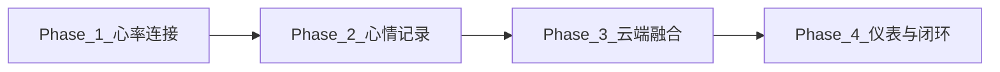
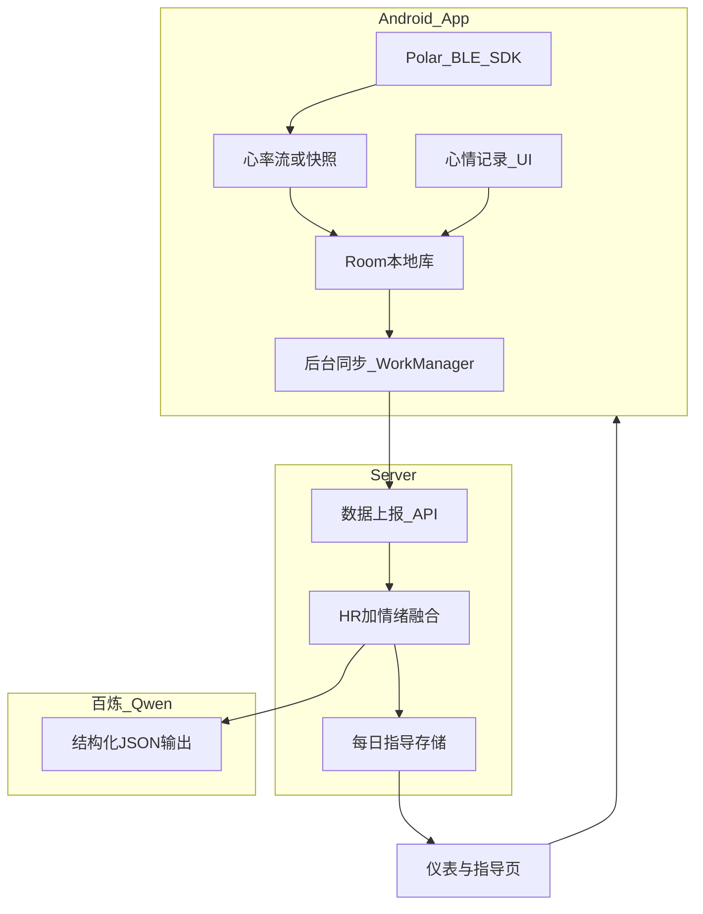

# 身心状态 App — 产品说明

## 产品是什么

**身心状态 App**（MindBody）是一款面向个人用户的 Android 应用，将 **Polar Loop 手环的客观生理信号** 与 **主观心理状态记录** 放在同一款产品里，并通过云端 AI 做每日融合分析，帮助用户更清楚地看见「身体在说什么」与「心里感受如何」之间的关系。

核心理念：**身心一体** —— 不只看心率数字，也不只写心情日记，而是把两者按时间对齐，形成可回顾、可迭代的个人洞察。

---

## 产品目标

### 长期目标

打造一款 **「身心状态一体化」** 的个人健康觉察工具：

1. **实时看见身体信号** —— 连接 Polar Loop 后，持续或按需获取心率数据
2. **快速记录心理状态** —— 0.5 秒情绪角色指认（可选短日记），坐标后台静默写入
3. **获得每日 AI 指导** —— 每晚/次日凌晨自动生成「今日身心画像 + 明日建议」
4. **历史越用越准** —— AI 结合近 7 日融合结果，输出跨日连续、非重复套话的个性化指导

### 设计原则

| 原则 | 说明 |
|------|------|
| 统一 Android App | 手环连接、心情记录、指导展示均在同一 App 内完成 |
| 云端 AI 分析 | 使用百炼 Qwen 自动融合 HR + 情绪，App 负责采集与展示 |
| 本地优先缓冲 | 心率与心情先存 Room，再增量同步，弱网可用 |
| 非医疗诊断 | 提供觉察与建议，不做医疗级 HRV/压力诊断声明 |

---

## 目标用户价值

- **想觉察身心关联的人**：例如高耗能、低价值感时心率是否偏高
- **已有 Polar Loop 的用户**：把手环从「只看运动数据」扩展为「日常身心记录」
- **习惯写简短日记的用户**：角色化点选 + 可选日记，比纯文字更高效
- **希望有反馈而非只记录的用户**：每日 AI 指导提供可执行的下一步建议

---

## 信息架构（规划中的完整 App）

| 页签 | 功能 | 状态 |
|------|------|------|
| **仪表** | 心情指数、心率摘要、成长阶段、今日主指导 | Phase 4 规划 |
| **心率** | 实时 BPM、多指标身心交织曲线、连接状态 | Phase 1 已实现 |
| **记录** | 情绪角色化记录（场景 A 2×2 舞台 / 场景 B 键盘沉浸 + 日记续号/序号） | Phase 2 已实现 |
| **历史** | 日记列表 + 角色微缩图（或象限 badge 回退）+ 关联 HR | Phase 2 已实现 |
| **指导** | 每日 AI 洞察（风险、模式、建议） | Phase 3 规划 |
| **设备** | Loop 连接、FTU、配对引导、连接模式切换、**心情提醒设置** | Phase 1–2 已实现 |
| **状态** | 焦虑指数、LLM 身心叙事、HRV 详情 + 实时合加速度/PPI/皮肤接触、反馈历史 | 已实现（局部 Phase 3 预览） |

**界面详解**：各页组成区块、交互流程与用户价值见 [UI-SCREENS.md](./UI-SCREENS.md)。

---

## 当前已实现功能（Phase 1）

### Polar Loop 连接与配置

- 集成 **Polar BLE SDK 8.0.0**，支持扫描、连接、断开
- **FTU 首次使用配置**向导（性别、身高、体重、静息心率等）
- 设备页配对提示（距离、单设备绑定、恢复出厂等）
- 已配对设备 ID 与 FTU 状态持久化（DataStore）
- **开发者模式**：设备页底部连点版本信息 7 次解锁，可进入「运行日志」页查看/复制 App 内 BLE 与同步日志（环形缓冲 800 条），以及「storage 看板」查看各表行数

### 心率采集与展示

- 连接成功后 **实时心率流**（`startHrStreaming`）
- 心率页展示：当前 BPM、连接状态、今日统计（样本数/平均/最低/最高）
- **身心交织曲线**：同一时间轴叠加心率、皮肤体温、HRV（PPI/RR 计算 RMSSD）与运动上下文；支持 1h/6h/24h 视窗、左右滑动查看今日历史、触摸竖线查看具体时间点数值
- **Room 本地存储** `hr_samples`（timestamp、bpm、rr_ms、`SyncMeta`），**全量永久保存**（已去掉 24h 自动删除）
- **批量缓冲写入**（`HrSampleBuffer`）：高频样本先入内存缓冲，达阈值或定时 flush，App 退出/断连时强制落盘
- **统一存储门面** `AppStorage`：功能层经 `app.storage.hr` 读写，不直接访问 Database/Repository

### 统一存储核心（P0，已完成）

横切模块，为 Phase 2～4 提供可扩展本地库基础：

- `SyncMeta` + `SyncState`：所有实体共用同步元数据约定
- Room **schema 导出 + WAL + 显式 Migration**（禁止 destructive migration）
- `SyncableDao` 契约 + `SyncManager` 占位（Phase 3 对接云端同步）
- 详见 [统一存储核心模块 Plan](../.cursor/plans/统一存储核心模块_5f5a20f2.plan.md)

### BLE 连接模式

支持两种策略，可在 **设备** 页切换并持久化：

| 模式 | 行为 | 适用场景 |
|------|------|----------|
| **常连接** | 打开 APP 后自动扫描并连接已保存设备；保持 BLE + 持续 HR 流；意外断线约 3 秒后自动重连 | 实时心率监测（当前默认） |
| **短连接** | 打开 APP 后同样自动连接已保存设备；记录心情时按需 `connectForSnapshot` 采集约 5 秒 HR 后断开；用户主动断开后不重连 | Phase 2 心情记录 HR 快照 |

### 后台保活

- 心率页进入时启动 **前台服务**，App 切到后台时尽量保持 BLE 采集不被系统杀死

---

## 分阶段路线图

### Phase 1 — 基础连接（已完成）

**目标：** Loop 连上，屏幕显示实时心率，本地可存可查。

**验收：** 真机 Polar Loop 稳定显示心率；常连接模式下断线可自动重连。

### Phase 2 — 心情记录移植（已完成，v4 情绪角色化 UI）

**前置：** P0 存储核心已完成。**子 Plan：** [phase2心情记录移植](../.cursor/plans/phase2心情记录移植.plan.md)。交互设计详见 [PRODUCT_EMOTION_DESIGN.md](./PRODUCT_EMOTION_DESIGN.md)。

**已实现：**

#### 主动记录页（底部导航「记录」）

采用 **场景 A / 场景 B 二分法**（`MoodRecordViewport`）：

| 场景 | 触发 | 交互 |
|------|------|------|
| **场景 A** | 默认进入 | 2×2 **ActorStage** 四角色（心流 / 内耗 / 麻木 / 焦焦）；无日记时点角色 **一键保存**；可展开全部 18 人；引导卡片进入写作 |
| **场景 B** | 点日记引导 / 键盘弹起 | 日记占主视野 + **胶囊栏 4+➕** + 句尾微型角色标签；键盘可见时隐藏免责声明 |

- 日记 Enter **列表续号**（对齐 emotion v3.7）；今日序号、上次记录时间
- 价值感×耗能 **坐标仍后台写入**（`coordX`/`coordY`），前台不再展示四象限网格
- **提醒设置** 迁至 **设备页**（间隔 / 静默 / 通知 / 强弹窗 / 测试提醒）

#### 定时探查（WorkManager 提醒）

- 强弹窗经 **FullScreenIntent 通知** 拉起 `MoodCheckInActivity`（Worker 禁止后台直接 `startActivity`，targetSdk 35 BAL 合规）
- **MobileCheckInDrawer**：皮克斯 **9 人 3×3** + 展开 9 人；锁屏穿透 + Keyguard 引导
- 弱通知点击 → 记录页；Esc / 稍后 / 通知栏快捷操作 → 逃避记录 + 20 分钟 snooze
- 设备页提示开启 **全屏通知权限**（API 34+ 未授权时降级为 Heads-up）

#### 历史与其他

- 历史：有 `roleId` 显示 **角色微缩图**，无 `roleId` 回退 `CoordMiniBadge`；极性/逃避样式、分页跳转、同日 `(i/total)`
- 记录时刻 **HR 快照**（MindBody 扩展）；`mood_entries` 含 `roleId`（Room v6）；数据经 `app.storage.mood` 读写

**验收：** 记录页场景 A/B 流畅切换、键盘弹起不闪退；探查无 BAL 拦截；HR 快照与历史展示正常。

### Phase 3 — 云端同步 + 融合 Pipeline

**前置：** Phase 2 本地 `mood_entries` 就绪。**子 Plan：** [phase3云端融合](../.cursor/plans/phase3云端融合.plan.md)

**目标：** 数据上报 + 每日自动生成指导。

- Android：Retrofit + WorkManager 增量同步
- Server：扩展 vitals/mood/guidance 模型与 API
- 百炼 Qwen：**HR + 情绪融合 Pipeline**，每日定时触发
- App「指导」页展示 `guidance_primary`、风险等级、心情指数等

**验收：** 当日有记录时，次日可在 App 看到与当日数据相关的新指导。

### Phase 4 — 仪表与历史优化

**前置：** Phase 3 每日指导可稳定生成。**子 Plan：** [phase4仪表与闭环](../.cursor/plans/phase4仪表与闭环.plan.md)

**目标：** 「每天生成新数据、新指导」的完整闭环。

- 仪表页：心情指数 + HR 趋势 + 成长阶段 + 今日主指导
- 7 日趋势与跨日 `continuity_summary` 展示
- 连续使用 7 天后，指导文案能体现历史模式变化

---

## 数据与 AI 融合（规划）

### 客户端数据

- **`hr_samples`**：高频心率（本地全量永久保存 + 批量缓冲写入；上传时按分钟聚合，原始 1Hz 保留本地）
- **`skin_temp_samples` / `ppi_samples` / `activity_minute_samples` / `training_sessions`**：本地多传感器时间轴数据，用于心率页交织曲线与后续融合分析；HRV 仅作为 RMSSD 等觉察指标展示，不作医疗诊断
- **`mood_entries`**：心情记录（`roleId`、坐标、日记、发生时间、`hr_at_entry`）
- **`daily_guidance_cache`**：云端下发的当日指导 JSON

### 融合思路

每条心情记录在时间上匹配 **±5 分钟** 内的心率样本，计算记录时刻 HR 与相对静息的偏差，作为 LLM 的结构化输入，降低「凭空编造」风险。

AI 输出契约延续 emotion **manifest v6** 方向，在 v5 基础上增加生理相关字段，例如：

- `hr_daily_avg`、`hr_resting_estimate`
- `mind_body_alignment`（主观耗能 vs 客观心率是否一致）
- `continuity_summary`（跨日连续摘要）

---

## 系统架构概览

---

## 明确不在本期范围

- iOS / Windows 客户端
- 实时流式 AI 对话
- 医疗级诊断或处方建议
- Polar Loop 睡眠/活动数据的深度融合（二期可考虑 `get247HrSamples`）
- 多用户账号体系（当前以 deviceId 区分设备即可）

---

## 成功指标（MVP 上线后参考）

| 指标 | 目标 |
|------|------|
| 日活连接 Loop 成功率 | > 90% |
| 日均心情记录 ≥ 1 条的用户占比 | > 60% |
| 每日指导生成成功率 | > 95% |
| 用户对指导「与当日状态相关」的主观评分 | 持续优化（二期调研） |

---

## 相关文档

- [README.md](./README.md) — 开发环境、运行步骤、项目结构
- [FEATURE-LEDGER.md](./FEATURE-LEDGER.md) — 已实现功能总索引（Agent 必读）；分清单 [`docs/feature-ledger/`](docs/feature-ledger/)
- [PRODUCT_EMOTION_DESIGN.md](./PRODUCT_EMOTION_DESIGN.md) — 情绪角色化 UI 与认知心理学设计指南
- [主路线图 Plan](../.cursor/plans/loop心情ai产品规划_9d502bd3.plan.md) — 总体愿景、API/数据模型
- [统一存储核心 Plan](../.cursor/plans/统一存储核心模块_5f5a20f2.plan.md) — P0 已完成
- [Phase 2 心情记录 Plan](../.cursor/plans/phase2心情记录移植.plan.md)
- [Phase 3 云端融合 Plan](../.cursor/plans/phase3云端融合.plan.md)
- [Phase 4 仪表与闭环 Plan](../.cursor/plans/phase4仪表与闭环.plan.md)
- [项目优先级 Rule](../.cursor/rules/project-priority.mdc) — Agent 冲突裁决与变更约定

---

*文档版本：Phase 1 + P0 + Phase 2（v4 情绪角色化 UI）；最后更新 2026-06-14。*
