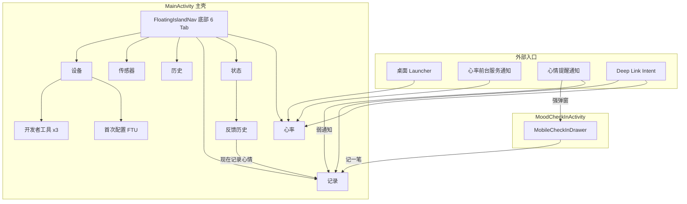
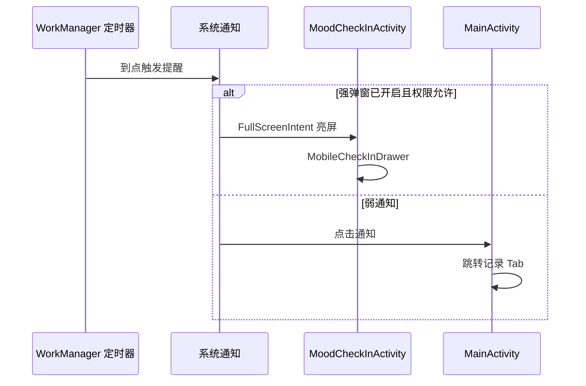

# MindBody Android 界面说明

> **文档定位**：面向产品、设计、测试与新成员 onboarding 的「现场手册」——描述当前 App 中**已实现**的全部用户可见界面、组成区块、交互流程与用户价值。  
> **App 版本**：0.4.4（versionCode 12）  
> **最后更新**：2026-06-24  
> **相关文档**：[PRODUCT.md](./PRODUCT.md)（产品目标与路线图）· [PRODUCT_EMOTION_DESIGN.md](./PRODUCT_EMOTION_DESIGN.md)（情绪角色设计理论）

---

## 1. 应用信息架构总览

MindBody Android 采用 **100% Jetpack Compose** 实现，主流程为 **单 Activity + NavHost**，无 Fragment、无 XML 导航图。用户日常在 `MainActivity` 内通过底部 6 Tab 切换；定时心情探查则通过独立 `MoodCheckInActivity` 以全屏 Bottom Sheet 形式出现。

### 1.1 底部导航 Tab 顺序

浮动胶囊岛导航栏（`FloatingIslandNav`），从左到右：

| 顺序 | Tab 名称 | 路由 ID | 图标语义 |
|------|----------|---------|----------|
| 1 | 心率 | `heart_rate` | 心形 |
| 2 | 状态 | `physio_state` | 监测心 |
| 3 | 记录 | `mood_record` | 编辑 |
| 4 | 历史 | `mood_history` | 历史 |
| 5 | 传感器 | `sensors` | 波形 |
| 6 | 设备 | `device` | 设置 |

**全局行为：**

- App 启动默认落在 **心率** Tab
- 进入栈内子页（反馈历史、FTU、开发者工具）时 **隐藏底部栏**
- **记录** Tab 键盘弹起时，底部栏自动隐藏，为日记输入让出空间
- Tab 切换采用 `saveState` / `restoreState`，返回时保留各 Tab 滚动位置

### 1.2 界面清单（已实现）

| 类型 | 数量 | 说明 |
|------|------|------|
| Activity | 2 | MainActivity、MoodCheckInActivity |
| 底部 Tab 页 | 6 | 见上表 |
| 栈内子页 | 5 | 反馈历史、FTU、运行日志、storage 看板、PPI 上传日志 |
| 弹层 / 对话框 | 4 类 | 角色选择 Sheet、探查 Drawer、编辑 Dialog、删除确认 |

---

## 2. 全局 UI 设计语言

MindBody 界面遵循统一的「**身体陪伴日记**」视觉哲学：大数字 Hero + 情境叙事 + 克制数据网格，避免医疗仪表盘的冷硬感。

### 2.1 布局模式

| 模式 | 说明 | 典型使用页 |
|------|------|------------|
| **Head / Middle / Bottom** | 上方 20% 大指标 Hero，中间 50% 叙事卡，下方 30% 数据网格 | 心率、状态、传感器 |
| **SectionHeader** | 眉题（如 MINDBODY INSIGHT）+ 页面标题 + 可选状态角标 | 全部主 Tab |
| **HeroIndicator** | 圆形呼吸环包裹主数值，带环形进度与副标题 | BPM、焦虑指数、合加速度 |
| **NarrativeCard** | 左侧强调色条 + Badge + 正文，传递「可读的情境描述」 | 皮温、LLM 反馈、运动质量 |
| **MicroGrid** | 2 列统计格，支持单位与小色块 | 今日 HR、HRV 六格、传感器读数 |
| **PremiumCard** | 大圆角白卡片，设备页与各功能区块容器 | 设备页、图表区 |

### 2.2 配色与气质

- **背景**：Apple Gray `#F2F2F7`，营造轻量、非临床感
- **主色**：Indigo — 链接、选中态、主按钮
- **心率**：HeartRed — BPM、心率相关数值
- **链接 / 展开**：CalmTeal — 「展开趋势图」「查看反馈历史」等引导
- **状态语义色**：平静（Teal）、正常（Indigo）、应激升高（Amber）、疑似焦虑（Rose）等，与「状态」Tab 联动

### 2.3 非医疗声明

多处界面（记录页免责声明、状态页文案）强调：**提供身心觉察与建议，不做医疗级 HRV/压力诊断**。

---

## 3. 底部 Tab 页面详解

以下每页按 **页面定位 → 界面组成（自上而下）→ 功能点 → 用户操作 → 用户价值** 描述。

---

### 3.1 心率 Tab —「实时心觉」

**页面定位**：Polar Loop 实时生理信号的「第一视窗」，把 BPM 与皮温变成可读的陪伴式叙述。

#### 界面组成

| 区块 | 用户看到的内容 | 功能点 |
|------|----------------|--------|
| **页眉** | 眉题 `MINDBODY INSIGHT` · 标题「实时心觉」· 连接状态徽章 | 一眼确认 BLE 是否在采集 |
| **Hero 区** | 大号 BPM 数字（未连接显示 `--`）· 连接状态文案 · 环形进度 | 实时心率；进度环随 BPM/200 变化 |
| **皮温叙事卡** | 皮肤温度 Badge + 分段体感描述 | 33–36.5°C 为舒适区间；偏低/偏高/未连接各有引导文案 |
| **今日生理负荷** | 2×2 网格：样本数、平均/最高/最低 BPM | 当日本地聚合统计 |
| **历史趋势图**（默认折叠） | 多指标曲线区 | HR、皮肤温度、HRV、运动上下文同轴叠加 |

#### 用户操作

- **展开 / 收起趋势图**：点击「历史趋势图」行切换
- **图表交互**：选择 1h / 6h / 24h 视窗；左右滑动查看今日历史；触摸竖线查看具体时间点数值
- **进入页面副作用**：自动启动后台心率流与前台服务，离开页面停止（常连接模式下保持采集）

#### 用户价值

把 Polar Loop 的客观信号变成「**可读的身体陪伴日记**」，而非裸数字仪表盘。用户无需理解 BPM 医学含义，也能从皮温叙事获得「此刻身体在说什么」的直觉。

#### 连接状态文案

| 状态 | Hero 副标题 |
|------|-------------|
| 已连接 | 连接就绪 · 正在采集 |
| 连接中 | 连接中… |
| 蓝牙关闭 | 请打开手机蓝牙 |
| 未连接 | 未连接设备 |

---

### 3.2 状态 Tab —「身心感知」

**页面定位**：将生理算法输出与 LLM 叙事合成「此刻身心状态」的一句话感知，是客观信号与主观记录的桥梁页。

#### 界面组成

| 区块 | 用户看到的内容 | 功能点 |
|------|----------------|--------|
| **页眉** | 「身心感知」 | — |
| **Hero 区** | **基线期**：窗口计数 + `/ 50 窗口` 进度；**成熟期**：焦虑指数 0–100 + 状态中文标签 | 两套 Hero 展示逻辑，带动画过渡 |
| **叙事卡** | **基线期**：建立个人基线说明 + 线性进度条 + `已收集 N / 50 个分析窗口`；**成熟期**：状态 Badge + 可选「⚡ 检测到心率突升」条 + LLM 正文 + 相对时间 | 基线需 50 个 15 分钟分析窗口 |
| **生理指标详情** | HRV 六格（仅基线完成后显示） | RMSSD、SDNN、LF/HF、呼吸频率、SampEn、DFA α1 |
| **底部链接** | 「查看全部 N 条反馈历史」 | 有历史记录时出现 |

#### 状态标签语义

| 状态 ID | 中文标签 | 含义（用户向） |
|---------|----------|----------------|
| baseline_building | 正在建立基线 | 系统仍在学习你的个人生理基线 |
| calm | 平静 | 身心平和放松 |
| normal | 正常 | 指标在正常范围 |
| elevated | 应激升高 | 轻度应激，建议适当休息 |
| anxious | 疑似焦虑 | 生理指标显示焦虑倾向 |
| high_anxiety | 高度焦虑 | 需关注当下感受 |

#### 用户操作

- 滚动浏览 HRV 详情
- 点击「查看全部反馈历史」进入栈内列表页

#### 用户价值

让用户在 **不打开日记** 的情况下，也能获得 AI 对当前身心状态的叙事化解读；心率突升标记帮助关联「身体突然紧张」与后续心情记录。

---

### 3.3 记录 Tab —「情绪角色化记录」

**页面定位**：Phase 2 核心交互——用 **18 位情绪角色** 替代抽象坐标，实现约 0.5 秒的极速指认，可选深度日记。

设计理论详见 [PRODUCT_EMOTION_DESIGN.md](./PRODUCT_EMOTION_DESIGN.md)。价值感×耗能坐标（coordX/coordY）**后台静默写入**，前台不展示四象限网格。

#### 场景 A：默认 · 极速指认

| 区块 | 用户看到的内容 | 功能点 |
|------|----------------|--------|
| **日期 + 序号** | 如「6月24日」「今日第 3 笔 (3/5)」 | 强化记录节奏感 |
| **ActorStage 2×2** | 心流 · 内耗 · 麻木 · 焦焦 | **无日记时点角色即保存** |
| **展开链接** | 「展开查看全部 18 位情绪角色」 | 打开底部 Sheet |
| **日记引导卡** | 「✍️ 想倾诉更多？点击这里写下日记…」 | 进入场景 B |

#### 场景 B：键盘沉浸 · 深度倾诉

| 区块 | 用户看到的内容 | 功能点 |
|------|----------------|--------|
| **DiaryInput** | 多行日记输入区，占主视野 | Enter 触发列表续号（emotion v3.7） |
| **EmotionCapsuleToolbar** | 4 个快捷角色 + ➕ 按钮 | 键盘上方 inline 切换角色 |
| **保存按钮** | 保存中… / 已收纳 / 保存记录 | 需先选角色；保存时关联 HR 快照 |
| **免责声明** | HR 关联非诊断说明 | 键盘可见时自动隐藏 |

#### 18 位情绪角色

**皮克斯主线（9 人）**：乐乐、忧忧、怒怒、怕怕、厌厌、焦焦、尬尬、丧丧、慕慕

**职场扩展（9 人）**：心流、内耗、麻木、自豪、怀疑、内疚、迷茫、顿悟、平静

#### 用户操作

| 操作 | 结果 |
|------|------|
| 场景 A 点四角色之一（无日记） | 立即保存，显示「已收纳」 |
| 点「展开查看全部 18 位」 | 打开 `EmotionRolePickerSheet` |
| 点日记引导卡 / 键盘弹起 | 切换至场景 B |
| 场景 B 点保存 | 写入 mood_entries，关联当时 HR 快照 |
| 保存成功 | 自动退出场景 B，回到场景 A |

#### 用户价值

**低门槛高频打卡**（场景 A）与 **深度倾诉**（场景 B）在同一页无缝切换；角色化设计降低「我不知道用什么词描述心情」的认知负担。

---

### 3.4 历史 Tab —「日记与角色回顾」

**页面定位**：回顾全部心情记录，支持编辑、删除与批量管理，是「记录」页的镜像与延伸。

#### 界面组成

| 区块 | 用户看到的内容 | 功能点 |
|------|----------------|--------|
| **页眉 + 总条数** | 「历史记录」+ 共 N 条 | — |
| **工具栏** | 本页全选复选框 · 已选计数 · 清除 · 删除所选 | 批量操作入口 |
| **列表** | 按日期分组 · 卡片列表 | 角色微缩图（无 roleId 时回退坐标 badge）；极性/逃避色调区分；可展开日记正文；关联 HR 芯片 |
| **单条操作** | 编辑 · 删除 | 编辑打开全屏 Dialog |
| **分页器** | « ‹ 页码 › » + 跳转输入框 | 每页 10 条 |

#### 弹窗

| 弹窗 | 触发 | 内容 |
|------|------|------|
| 编辑 Dialog | 点「编辑」 | 复用记录视口 MODAL 变体：角色网格 + 日记 |
| 单删确认 | 点「删除」 | AlertDialog 确认/取消 |
| 批量删确认 | 点「删除所选」 | AlertDialog 确认/取消 |

#### 用户操作

- 展开/折叠单条日记
- 勾选多条后批量删除
- 输入页码跳转
- Toast 提示操作结果（2 秒自动消失）

#### 用户价值

让记录 **可回顾、可修正**；HR 芯片帮助用户事后对照「当时心率与心情是否一致」。

---

### 3.5 传感器 Tab —「原始信号透视」

**页面定位**：面向想理解「手环到底在采什么」的进阶用户，透明展示 ACC 与 PPI 原始读数。

#### 界面组成

| 区块 | 用户看到的内容 | 功能点 |
|------|----------------|--------|
| **页眉** | 「传感器数据」+ 连接徽章 | — |
| **Hero 区** | 合加速度幅值 (g) + 运动分类 | 静止 / 轻微活动 / 中等运动 / 剧烈运动 |
| **叙事卡** | 「运动 · 心跳质量」Badge + 运动状态说明 + PPI 质量评语 | 运动干扰 blockerBit、皮肤接触差等警告 |
| **原始传感器读数** | 2×2 网格 8 项 | ACC X/Y/Z、\|a\|、PPI、实时 HR、PPI 误差、皮肤接触 |

#### 运动分类阈值

| 合加速度 | 分类 |
|----------|------|
| < 0.95g | 静止 |
| 0.95–1.2g | 轻微活动 |
| 1.2–2.0g | 中等运动 |
| ≥ 2.0g | 剧烈运动 |

#### 用户价值

帮助用户理解 **HRV 数据质量受运动与佩戴影响**，解释「状态」Tab 分析为何有时延迟或不准——增强信任而非隐藏算法黑箱。

---

### 3.6 设备 Tab —「硬件与提醒中枢」

**页面定位**：Polar Loop 连接、FTU、BLE 策略、后台保活、心情提醒与开发者工具的 **一站式管理中枢**。

#### 界面组成（自上而下）

**1. 设备状态卡**

- Polar Loop 手环名称 · ACTIVE / IDLE 徽章
- 硬件电量（≤20% 红色警示）
- 状态消息行
- 已连接时：设备离线同步状态行

**2. 实时推流分析卡**（仅 BLE 已连接）

- 当前生理状态、基线窗口数、最近推流时间

**3. BLE 采集频率策略**

| 模式 | 说明 |
|------|------|
| 常连接监测流（默认） | 保持高频数据不中断，意外断连 3 秒自动重连 |
| 心情关联秒捕（省电） | 仅记录心情时唤醒蓝牙采集约 5 秒 HR 快照 |

**4. 健康档案 (FTU)**

- 性别/身高、体重/年龄、静息率基线状态格
- 未完成时显示「去配置」链接

**5. 连接操作**

- 扫描 · 连接已保存 · 完成首次配置 · 断开 · 刷新

**6. 后台保活**

- 电池优化豁免状态 · 前台服务 / BLE / 心跳实时状态 · 诊断提示
- 操作引导 · 「设为无限制」「打开自启动」
- 页面恢复时自动 `checkAndRecover`（BLE 已连但 FGS 未跑则补偿启动）

**7. 配对提示**

- 距离、单设备绑定、恢复出厂等只读建议

**8. 提醒设置**（`MoodSettingsSection`）

| 设置项 | 说明 |
|--------|------|
| 启用通知 | 总开关 |
| 强弹窗 | 锁屏全屏探查 + 前台 Bottom Sheet |
| 提醒间隔 | 1–1440 分钟 |
| 静默时段 | 开始/结束 HH:mm |
| 测试提醒 | 30s / 60s 快捷测试 |
| 今日已记录 N 条 | 只读统计 |

API 34+ 未授权全屏通知权限时，显示降级提示（Heads-up 替代 FullScreenIntent）。

**9. 扫描结果列表**

- 设备名 · ID · RSSI · 点击连接

**10. 开发者选项**（连点版本脚注 7 次解锁）

- 运行日志 · storage 看板 · PPI 上传日志
- 云端同步：Server URL、API Key、自动同步（每 2h）、立即同步
- ntfy 推送 Topic 复制

**11. 版本脚注**

- `MindBody v0.4.4 · Polar SDK …` — 隐藏手势入口

#### 用户价值

把 **硬件连接、提醒节奏、高级调试** 集中在一页，记录页保持纯粹；提醒设置后置于此，符合「记录页只做记录」的设计原则。

---

## 4. 栈内子页面

进入以下页面时 **底部 Tab 栏隐藏**，通过 TopBar 返回或完成操作后 pop 回上一页。

### 4.1 反馈历史

**入口**：状态 Tab →「查看全部 N 条反馈历史」

| 区块 | 内容 |
|------|------|
| TopBar | 标题「反馈历史」+ 返回 |
| 空状态 | 「还没有 LLM 反馈历史…」引导卡 |
| 列表卡片 | 状态 Badge · 时间 · 焦虑指数 · LLM 正文（超 120 字可「展开全文」）· 用户响应标签 |
| 行动按钮 | 尚无用户回应时显示「现在记录心情 →」，跳转记录 Tab |

**用户响应标签**：✓ 已记录心情 · ○ 已推迟 · × 已忽略

### 4.2 FTU 首次使用配置

**入口**：设备 Tab →「去配置」/「完成首次配置」

| 状态 | 内容 |
|------|------|
| 表单 | 生理性别（男/女）· 出生年份 · 身高(cm) · 体重(kg) · 静息心率(bpm，默认 60) |
| 提交 | 「写入手环并完成配置」按钮，提交中显示加载 |
| 成功 | 「首次配置已完成！」+ 返回按钮 → 回到设备页 |

### 4.3 开发者三页（隐藏入口）

| 页面 | 主要功能 |
|------|----------|
| **运行日志** | 复制全部 · 清空 · 自动滚动开关 · 等宽可选中日志流（BLE/同步环形缓冲） |
| **storage 看板** | 刷新（flush + 重计数）· 汇总卡 · 分类表行数（LIVE_STREAM / OFFLINE_SYNC / BUSINESS） |
| **PPI 上传日志** | 统计摘要 · 跳过原因分布 · 时间线 · 复制 JSON · 清空 · 尝试列表 |

---

## 5. 独立 Activity — 定时探查弹窗

**Activity**：`MoodCheckInActivity`（锁屏可显示、穿透 Keyguard）

**UI 组件**：`MobileCheckInDrawer` — 半透明遮罩 + Modal Bottom Sheet

### 5.1 触发路径

### 5.2 界面组成

| 区块 | 内容 | 功能点 |
|------|------|--------|
| 标题区 | 日期 · 今日序号 · 「到时间了，留意一下此刻」 | 建立探查情境 |
| 3×3 优先网格 | 皮克斯 9 人 | 点击 → 长按触觉 → 300ms → 快速保存 |
| 扩展角色 | 「扩展角色 · 9 个」→ 职场扩展 9 人网格 | 可收起 |
| 底部操作 | 稍后 · 记一笔（+ 可选「关闭」soft 模式） | 见下表 |
| 脚注提示 | 遮罩/稍后 = 逃避记录 + 20 分钟后再次提醒 | — |

### 5.3 用户操作

| 操作 | 行为 |
|------|------|
| 点优先/扩展角色 | 保存该角色，调度下次提醒，关闭探查 |
| 稍后 / 点遮罩 | 记录「逃避」，20 分钟后 snooze 再提醒 |
| 记一笔 | 解除 Keyguard → 打开 MainActivity 记录 Tab → 关闭探查 |
| 关闭（soft 模式） | 仅 dismiss，不 snooze |

### 5.4 与主动记录页的差异

| 维度 | 记录 Tab 场景 A | 定时探查 Drawer |
|------|-----------------|-----------------|
| 首发角色 | 4 人（心流/内耗/麻木/焦焦） | 9 人皮克斯 3×3 |
| 扩展角色 | 其余 14 人 Sheet | 职场扩展 9 人 |
| 无日记点选 | 立即保存 | 300ms 延迟 + 双次触觉反馈 |
| 逃避语义 | 无 | 「稍后」= snooze + 逃避记录 |
| 深度日记 | 页内场景 B | 「记一笔」跳转主 App |

---

## 6. 弹层与对话框汇总

| 组件 | 类型 | 出现位置 | 交互 |
|------|------|----------|------|
| EmotionRolePickerSheet | Modal Bottom Sheet | 记录页场景 A/B | 18 人网格，选中即关闭 |
| MobileCheckInDrawer | Bottom Sheet + 遮罩 | MoodCheckInActivity | 见第 5 章 |
| MoodEditForm Dialog | 宽 95% Dialog | 历史页编辑 | 角色 + 日记，保存/取消 |
| 删除确认 AlertDialog | 系统对话框 | 历史页 | 单删/批量删确认 |

---

## 7. 外部入口与跨页跳转

| 入口 | 目标 | 典型场景 |
|------|------|----------|
| 桌面 Launcher | 心率 Tab | 日常打开 App |
| 心率前台服务通知 | 心率 Tab | 后台采集时回前台 |
| 提醒弱通知点击 | 记录 Tab | 通知栏补记心情 |
| 提醒强弹窗 | MoodCheckInActivity | 锁屏/息屏定时探查 |
| Intent `navigate_to=heart_rate` | 心率 Tab | 外部 Deep Link |
| Intent `navigate_to=mood_record` | 记录 Tab | 探查「记一笔」、通知 Action |
| 状态 → 反馈历史 → 记录 | 跨 Tab | 看完 AI 反馈后立刻记录 |
| 设备 → FTU | 栈内 | 新手环首次配置 |
| 探查「记一笔」 | 记录 Tab | 从快选升级到完整日记 |

---

## 8. 附录

### A. 界面—源码对照表

| 界面 | 源码路径（相对 `com/owner/mindbody/`） |
|------|----------------------------------------|
| 导航壳 | `ui/navigation/AppNavigation.kt` |
| 底部导航 | `ui/components/FloatingIslandNav.kt` |
| 心率 | `ui/heartrate/HeartRateScreen.kt` |
| 状态 | `ui/physio/PhysioStateScreen.kt` |
| 反馈历史 | `ui/physio/FeedbackHistoryListScreen.kt` |
| 记录 | `ui/mood/MoodRecordScreen.kt` · `MoodRecordViewport.kt` |
| 历史 | `ui/mood/MoodHistoryScreen.kt` |
| 传感器 | `ui/sensors/SensorsScreen.kt` |
| 设备 | `ui/device/DeviceScreen.kt` |
| FTU | `ui/ftu/FtuScreen.kt` |
| 探查抽屉 | `ui/mood/MobileCheckInDrawer.kt` |
| 探查 Activity | `MoodCheckInActivity.kt` |
| 运行日志 | `ui/developer/DeveloperLogScreen.kt` |
| storage 看板 | `ui/developer/DeveloperStorageScreen.kt` |
| PPI 上传日志 | `ui/developer/PpiUploadLogScreen.kt` |
| 情绪角色定义 | `ui/mood/EmotionRole.kt` |

### B. 未实现 / 规划中界面

以下页签在 [PRODUCT.md](./PRODUCT.md) 路线图中有规划，**尚未出现在当前 NavHost**：

| 页签 | 规划阶段 | 说明 |
|------|----------|------|
| 仪表 | Phase 4 | 心情指数、心率摘要、成长阶段、今日主指导 |
| 指导 | Phase 3 | 独立 Tab 展示每日 AI 洞察 |

当前「状态」Tab 的 LLM 叙事与反馈历史，是 Phase 3 能力的 **局部预览**，完整仪表与指导闭环待后续 Phase 落地。

### C. 关联功能 ID（FEATURE-LEDGER 摘要）

| 功能 ID | 对应界面 |
|---------|----------|
| F-P1-006 | 心率页 UI 与统计曲线 |
| F-P1-007 | 设备页与配对引导 |
| F-P1-012 | 身心交织多指标曲线 |
| F-P2-004 | 记录页 MoodRecordScreen |
| F-P2-007 | 历史列表 MoodHistoryScreen |
| F-P2-011 | 强弹窗 CheckIn + snooze |
| F-P2-013 | 情绪角色化 UI v4 |
| F-P2-UI-001 | UI 全盘重构（日记本设计哲学） |

### D. 变更记录

| 日期 | 版本 | 说明 |
|------|------|------|
| 2026-06-24 | 0.4.4 | 首版：覆盖 2 Activity、6 Tab、5 栈内页、4 类弹层 |
